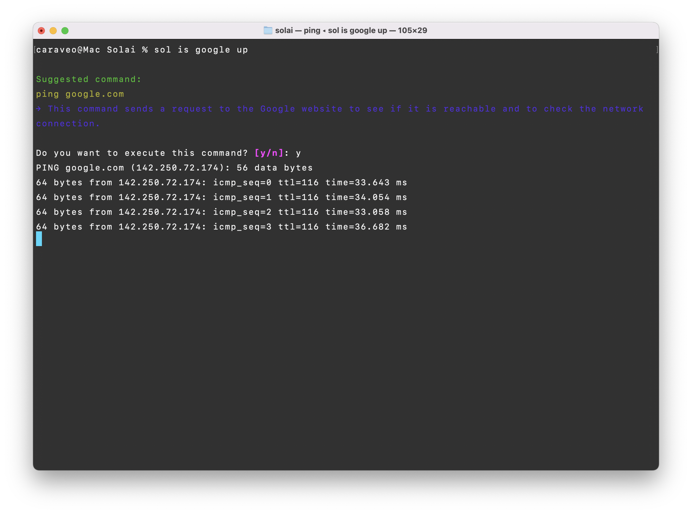

# Solai - Your Smart CLI Assistant

Solai is an AI-powered command-line interface assistant that helps you find and execute the right commands for your tasks. It supports local AI (via Msty Studio or MLX) and cloud AI (OpenAI) to convert natural language queries into system commands, with built-in safety confirmations and OS-specific command generation.

It came in a dream. "Thank you for this gift."

## Features

- 🤖 Natural language to CLI command conversion
- 💡 Command explanations for better understanding
- ✅ Command confirmation before execution
- 🔒 Secure API key storage
- 🏠 **Local AI support via Msty Studio** - Run completely offline and private
- 🍎 **MLX support** - Apple Silicon optimized local AI
- ☁️ Cloud AI support via OpenAI
- 💻 OS-specific command generation (macOS, Linux, Windows)
- 🎨 Rich terminal output formatting
- ⚙️ Easy configuration with `sol --configure`

## Installation

### Option 1: Install from PyPI (Recommended)
```bash
pip install solai
```

### Option 2: Install from Source
1. Clone the repository:
```bash
git clone https://github.com/caraveo/solai.git
cd solai
pip install -e .
```

## Quick Start

### Using Local AI (Msty Studio) - Recommended

1. **Install and start Msty Studio**
   - Download Msty Studio from: https://msty.ai
   - Launch Msty Studio and ensure it's running locally
   - Msty Studio typically runs on `http://localhost:1234/v1`

2. **First-time setup**
   - Run any `sol` command to trigger the setup wizard
   - Choose option 1 for "Local AI (Msty Studio)"
   - Enter your Msty Studio API base URL (default: `http://localhost:1234/v1`)
   - Enter your model name (default: `mistral`)
   - Configuration will be saved to `~/.solai.env`

3. **Run a command:**
```bash
sol find large files
```

### Using MLX (Apple Silicon) - Optimized for Mac

1. **Install and start MLX server**
   - Set up an MLX-compatible server running locally
   - MLX server typically runs on `http://localhost:11973/v1`

2. **First-time setup**
   - Run any `sol` command to trigger the setup wizard
   - Choose option 2 for "MLX - Apple Silicon optimized local AI"
   - Enter your MLX API base URL (default: `http://localhost:11973/v1`)
   - Enter your model name (default: `mlx-community/Qwen2.5-0.5B-Instruct-4bit`)
   - Configuration will be saved to `~/.solai.env`

3. **Run a command:**
```bash
sol find large files
```

### Using OpenAI Cloud

1. **First-time setup**
   - Run any `sol` command to trigger the setup wizard
   - Choose option 2 for "OpenAI Cloud"
   - Get your API key from: https://platform.openai.com/api-keys
   - Configuration will be securely stored in `~/.solai.env`

2. **Run a command:**
```bash
sol find large files
```

Example output:
```bash
Suggested command:
find ~ -type f -size +100M
→ Searches your home directory for files larger than 100 megabytes

Do you want to execute this command? [y/n]:
```



## Usage Examples

```bash
# Find files
sol find all pdf files in downloads

# System maintenance
sol clean up system cache

# Network commands
sol check if google.com is up

# File operations
sol create a backup of my documents
```

## Development

To install in development mode:

```bash
git clone https://github.com/caraveo/solai.git
cd solai
pip install -e .
```

## Requirements

- Python 3.6+
- **For Local AI**: Msty Studio installed and running
- **For MLX**: MLX server installed and running (Apple Silicon optimized)
- **For Cloud AI**: OpenAI API key
- Required packages:
  - click
  - python-dotenv
  - openai
  - rich

## Configuration

Configuration is stored in `~/.solai.env`. The setup wizard will guide you through the initial configuration.

### Local AI Configuration (Msty Studio)
```env
AI_PROVIDER=local
API_BASE_URL=http://localhost:1234/v1
API_KEY=not-needed
MODEL=mistral
```

### MLX Configuration (Apple Silicon)
```env
AI_PROVIDER=mlx
API_BASE_URL=http://localhost:11973/v1
API_KEY=not-needed
MODEL=mlx-community/Qwen2.5-0.5B-Instruct-4bit
```

### Cloud AI Configuration (OpenAI)
```env
AI_PROVIDER=openai
API_KEY=your-api-key-here
MODEL=gpt-3.5-turbo
```

To reconfigure, simply delete `~/.solai.env` and run any `sol` command to trigger the setup process again.

## Contributing

1. Fork the repository
2. Create your feature branch (`git checkout -b feature/amazing-feature`)
3. Commit your changes (`git commit -am 'Add amazing feature'`)
4. Push to the branch (`git push origin feature/amazing-feature`)
5. Open a Pull Request

## License

MIT License

## Contact

Jon Caraveo - jon@ziavision.com

Project Link: [https://github.com/caraveo/solai](https://github.com/caraveo/solai)
