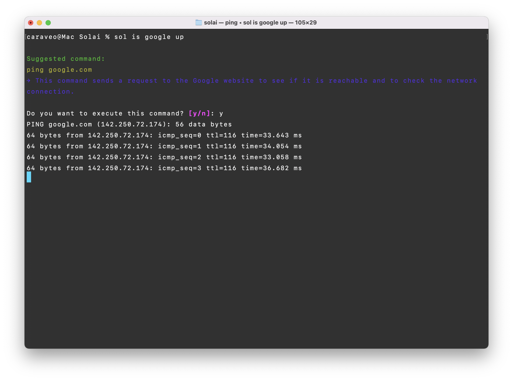

# Solai - Your Smart CLI Assistant

Solai is an AI-powered command-line interface assistant that helps you find and execute the right commands for your tasks. It uses OpenAI's GPT to convert natural language queries into system commands, with built-in safety confirmations and OS-specific command generation.

It came in a dream. "Thank you for this gift."

## Features

- 🤖 Natural language to CLI command conversion
- 💡 Command explanations for better understanding
- ✅ Command confirmation before execution
- 🔒 Secure API key storage
- 💻 OS-specific command generation (macOS, Linux, Windows)
- 🎨 Rich terminal output formatting

## Installation

### Option 1: Install from PyPI (Recommended)
```bash
pip install solai
```

### Option 2: Install from Source
1. Clone the repository:
```bash
git clone https://github.com/caraveo/solai.git
cd solai
pip install -e .
```

## Quick Start

1. First-time setup will prompt for your OpenAI API key
   - Get your API key from: https://platform.openai.com/api-keys
   - The key will be securely stored in `~/.solai.env`

2. Run a command:

```bash
sol find large files
```

Example output:
```bash
Suggested command:
find ~ -type f -size +100M
→ Searches your home directory for files larger than 100 megabytes

Do you want to execute this command? [y/n]:
```



## Usage Examples

```bash
# Find files
sol find all pdf files in downloads

# System maintenance
sol clean up system cache

# Network commands
sol check if google.com is up

# File operations
sol create a backup of my documents
```

## Development

To install in development mode:

```bash
git clone https://github.com/caraveo/solai.git
cd solai
pip install -e .
```

## Requirements

- Python 3.6+
- OpenAI API key
- Required packages:
  - click
  - python-dotenv
  - openai
  - rich

## Configuration

The OpenAI API key is stored in `~/.solai.env`. To update it, simply delete this file and run any sol command to trigger the setup process again.

## Contributing

1. Fork the repository
2. Create your feature branch (`git checkout -b feature/amazing-feature`)
3. Commit your changes (`git commit -am 'Add amazing feature'`)
4. Push to the branch (`git push origin feature/amazing-feature`)
5. Open a Pull Request

## License

MIT License

## Contact

Jon Caraveo - jon@ziavision.com

Project Link: [https://github.com/caraveo/solai](https://github.com/caraveo/solai)
